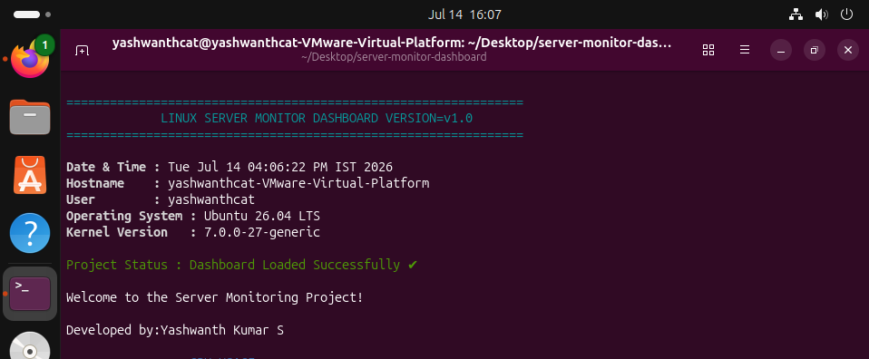
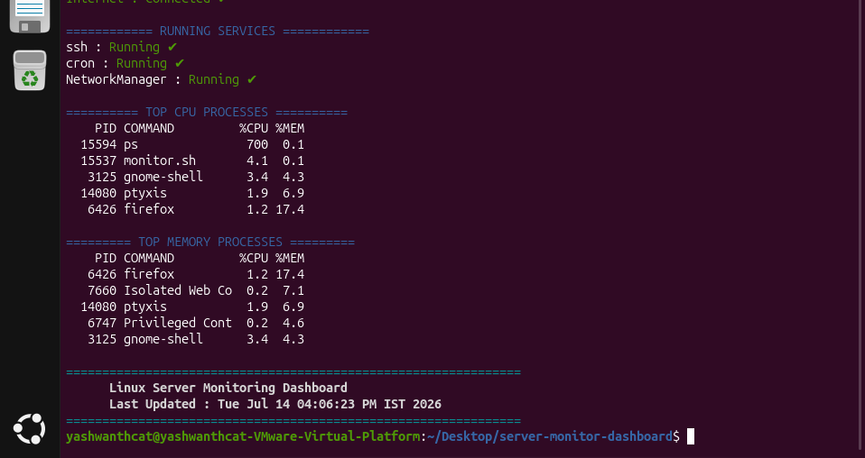
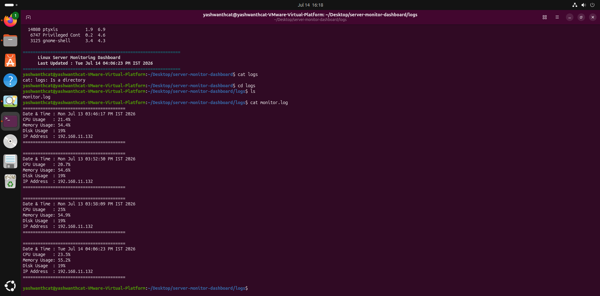

# Linux Server Monitoring Dashboard

## Overview

This project is a Linux Server Monitoring Dashboard developed using Bash scripting on Ubuntu Linux. It provides real-time system monitoring through a simple and user-friendly terminal dashboard.

The script monitors CPU usage, memory usage, disk usage, system uptime, network information, running services, top CPU and memory consuming processes, health status, and stores monitoring logs for future reference.

---

## Features

- System Information
- CPU Usage Monitoring
- Memory Usage Monitoring
- Disk Usage Monitoring
- System Uptime
- Network Information
- Running Services Status
- Top CPU Processes
- Top Memory Processes
- Progress Bars
- Health Summary
- Monitoring Logs

## Technologies Used

- Bash Shell Scripting
- Ubuntu Linux
- Linux Commands
- System Monitoring Utilities

---

## Project Structure

```text
Server-Monitoring-Script-Bash-/
│
├── monitor.sh
├── README.md
├── LICENSE
├── logs/
│   └── monitor.log
│
└── screenshots/
    ├── dashboard.png
    ├── resource-monitor.png
    ├── processes.png
    ├── health-summary.png
    └── logs.png
```

## Installation

Clone the repository.

```bash
git clone https://github.com/Yashwanth127/Server-Monitoring-Script-Bash-.git
```

Move into the project folder.

```bash
cd Server-Monitoring-Script-Bash-
```

Make the script executable.

```bash
chmod +x monitor.sh
```

Run the script.

```bash
./monitor.sh
```

## Screenshots

### Dashboard



---

### Resource Monitoring


---

### Running Services



---

### Health Summary


---

### Monitoring Logs



## Future Improvements

- Email notifications
- Docker container monitoring
- Auto-refresh dashboard
- CSV report generation
- Cron Job Scheduling
- Multiple Server Monitoring

---

## Author

**Yashwanth Kumar S**

MCA Graduate (2025)

Linux | Bash | Python | AWS | DevOps Learner | Networking | CyberSecurity

GitHub:
https://github.com/Yashwanth127

